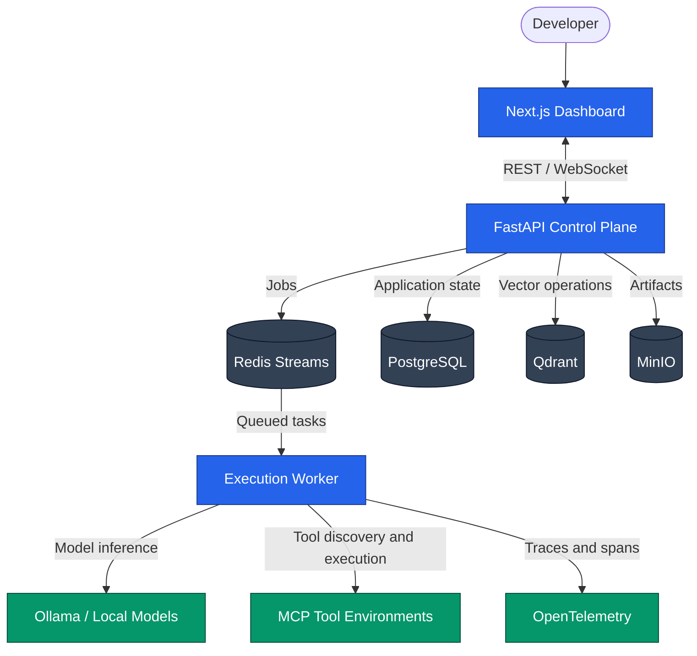
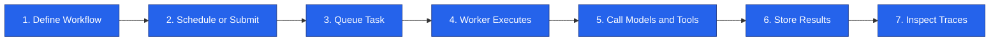

<div align="center">

# NeuroMeshOSS

### Local-First AI Agent Orchestration

Build, schedule, trace, and execute autonomous multi-agent graph workflows with a modular, developer-friendly platform.

<p>
  <a href="https://github.com/sargaprasadrs/NeuroMeshOSS/actions/workflows/ci.yml">
    
  </a>
  <a href="https://opensource.org/licenses/MIT">
    
  </a>
  
  
  <a href="https://github.com/sargaprasadrs/NeuroMeshOSS/stargazers">
    
  </a>
</p>

<p>
  <a href="#-quick-start">Quick Start</a>
  •
  <a href="#-architecture">Architecture</a>
  •
  <a href="#-features">Features</a>
  •
  <a href="#-development">Development</a>
  •
  <a href="#-contributing">Contributing</a>
</p>

<br>

> **Docker + Kubernetes + LangGraph + MCP + n8n + Temporal + OpenTelemetry**
>
> A simpler, lighter, modular, and developer-friendly approach to AI agent orchestration.

</div>

---

## What is NeuroMeshOSS?

NeuroMeshOSS is an **open-source, local-first AI Agent Orchestration Platform** for designing and running autonomous multi-agent workflows.

It gives developers the building blocks to:

- Create graph-based AI agent workflows
- Connect agents to tools and external environments
- Schedule and execute workflows
- Run workloads locally with Ollama
- Scale execution through workers and queues
- Monitor workflow execution with distributed tracing
- Inspect and manage workflows from a Next.js dashboard
- Integrate tools dynamically through the Model Context Protocol

---

## Why NeuroMeshOSS?

| Challenge | NeuroMeshOSS Approach |
|---|---|
| AI workflows become difficult to manage | Model workflows as explicit, traceable graphs |
| Cloud-only model platforms create vendor lock-in | Run locally with Ollama and use cloud providers when needed |
| Tool integrations require custom plumbing | Discover and resolve tools through MCP |
| Distributed execution is difficult to debug | Capture traces with OpenTelemetry |
| Large orchestration platforms are complex | Use a modular architecture with independent services |
| Scaling requires rewriting the application | Separate control-plane logic from worker execution |

---

## Features

<details open>
<summary><strong> Modular Architecture</strong></summary>

NeuroMeshOSS uses Domain-Driven Design and Ports & Adapters architecture.

Core domain entities remain independent from infrastructure such as:

- Databases
- Queues
- Telemetry providers
- Model providers
- External tool environments

This makes the platform easier to test, extend, and maintain.

</details>

<details open>
<summary><strong> Local-First Execution</strong></summary>

Run AI workflows locally using:

- Ollama-compatible local models
- Redis Streams for lightweight job queues
- PostgreSQL for application state
- Qdrant for vector storage
- MinIO for object and artifact storage

Cloud model providers can still be configured when required.

</details>

<details>
<summary><strong> Model Context Protocol Support</strong></summary>

NeuroMeshOSS includes an MCP client host capable of dynamically discovering and resolving tool environments.

This allows agents to interact with tools without hard-coding every integration directly into the workflow engine.

</details>

<details>
<summary><strong> Built-in Observability</strong></summary>

Workflow execution is designed with telemetry in mind.

OpenTelemetry-powered tracing can help you inspect:

- Workflow execution paths
- Agent activity
- Tool calls
- Task duration
- Distributed execution
- Worker activity
- Failures and retries

</details>

<details>
<summary><strong> Worker-Based Execution</strong></summary>

The control plane and execution workers are separated.

This enables you to:

- Submit workflows through the API
- Queue tasks through Redis Streams
- Execute tasks asynchronously
- Run multiple worker processes
- Scale execution independently from the API

</details>

<details>
<summary><strong> Security by Design</strong></summary>

The platform includes security controls for common infrastructure risks:

- Filesystem path traversal protection
- MCP HTTP SSRF mitigation
- Password hashing with bcrypt
- Workspace-bound file operations
- Protection against loopback and metadata subnet access

</details>

---

##  Architecture



---

## How a Workflow Runs



A typical execution flow looks like this:

1. A workflow is created through the dashboard or API.
2. The workflow is submitted immediately or scheduled for later.
3. The control plane places execution tasks into Redis Streams.
4. A worker consumes the task.
5. Agents call local models, cloud providers, or MCP tools.
6. Results and artifacts are persisted.
7. OpenTelemetry traces make the execution inspectable.

---

## Repository Structure

```text
NeuroMeshOSS/
├── .github/                    # CI pipeline and community templates
├── docker/                     # Docker configurations for backend and frontend
├── backend/                    # FastAPI control plane and worker daemon
│   ├── src/
│   │   ├── core/               # Domain entities and port interfaces
│   │   ├── adapters/           # Database, queue, and telemetry adapters
│   │   ├── services/           # Application use-case services
│   │   └── api/                # REST endpoints and WebSocket gateways
│   └── tests/                  # Unit and integration tests
├── cli/                        # Click/Typer command-line utility
├── sdk/                        # Python and TypeScript SDK libraries
├── frontend/                   # Next.js workspace dashboard
├── Makefile                    # Development task runner
└── docker-compose.yml          # Local PostgreSQL, Redis, Qdrant, and MinIO stack
```

---

## Quick Start

### Prerequisites

Before starting, install:

- Python 3.12+
- [Poetry](https://python-poetry.org/)
- Node.js 20+
- NPM
- Docker and Docker Compose

Docker is optional for the application itself, but is recommended for running the local infrastructure services.

---

### 1. Clone the Repository

```bash
git clone https://github.com/sargaprasadrs/NeuroMeshOSS.git
cd NeuroMeshOSS
```

---

### 2. Initialize the Workspace

Install backend dependencies, CLI requirements, SDK tools, and frontend packages:

```bash
make init
```

---

### 3. Configure Your Environment

Generate your local configuration file:

```bash
poetry run neuromesh init
```

You can optionally add model provider API keys to your `.env` file.

For a local-first setup, configure your environment to use Ollama where available.

---

### 4. Start Local Infrastructure

Launch PostgreSQL, Redis, Qdrant, and MinIO:

```bash
make dev-infra
```

---

### 5. Seed the Database

Populate the database with the default admin user and the sample **Market Analyzer Agent Flow**:

```bash
cd backend
poetry run python scripts/seed.py
cd ..
```

---

### 6. Start the Control Plane

Open a new terminal from the repository root:

```bash
poetry run neuromesh serve
```

---

### 7. Start the Worker

Open another terminal from the repository root:

```bash
poetry run neuromesh worker
```

---

### 8. Start the Frontend

If the frontend is not already started by your development setup, open another terminal:

```bash
cd frontend
npm run dev
```

---

### 9. Open the Dashboard

Visit:

```text
http://localhost:3000
```

You should now be able to access the NeuroMeshOSS workspace dashboard.

---

## Diagnostics

If you encounter issues during setup, run:

```bash
poetry run neuromesh doctor
```

The diagnostic command checks important local-first dependencies, including:

- PostgreSQL connectivity
- Redis Streams availability
- Ollama availability
- MCP configuration
- Local service connectivity

Example:

```text
PostgreSQL       ✅ Connected
Redis Streams    ✅ Available
Ollama           ✅ Detected
MCP Configuration ✅ Valid
```

---

## Local-First Model Execution

NeuroMeshOSS is designed to work well with local model runtimes such as Ollama.

This makes it possible to:

- Develop without sending data to external providers
- Reduce latency for local workflows
- Experiment with models privately
- Avoid mandatory cloud infrastructure
- Switch between local and hosted model providers

Cloud provider API keys can be added to the `.env` configuration when needed.

---

## MCP Tool Environments

NeuroMeshOSS acts as an MCP client host.

MCP integrations can provide agents with access to capabilities such as:

- Filesystem operations
- Databases
- Search tools
- APIs
- Developer tools
- Custom internal services

The MCP client can dynamically discover and resolve tool environments, allowing the agent runtime to work with tools through a standard protocol.

---

## Observability

Telemetry is part of the platform architecture rather than an afterthought.

OpenTelemetry can be used to observe:

```text
Workflow
  ├── Agent execution
  │     ├── Model calls
  │     ├── Tool calls
  │     └── Intermediate results
  ├── Queue operations
  ├── Worker execution
  └── Final workflow result
```

This makes it easier to investigate:

- Slow workflows
- Failed agent steps
- Long-running tool calls
- Queue delays
- Worker failures
- Multi-agent execution paths

---

## Security

NeuroMeshOSS includes several built-in security protections.

| Protection | Description |
|---|---|
| Path traversal protection | Filesystem tools validate paths using `os.path.commonpath` |
| Workspace isolation | File operations are bound to active workspace folders |
| SSRF mitigation | MCP HTTP requests block loopback and metadata network targets |
| Password hashing | User passwords are hashed using bcrypt |
| Password validation | Passwords require a minimum length of 8 characters |

### Path Traversal Protection

Filesystem tool providers prevent relative path escapes and restrict file access to approved workspace locations.

### SSRF Mitigation

The MCP HTTP client blocks access to dangerous targets such as:

- `127.0.0.1`
- Loopback addresses
- Cloud metadata addresses such as `169.254.169.254`
- Restricted private network destinations

> Security controls should always be reviewed and tested against the deployment environment before production use.

---

## Development

### Run the Test Suite

```bash
make test
```

### Check Formatting and Types

```bash
make lint
```

### Format the Codebase

```bash
make format
```

### Run Diagnostics

```bash
poetry run neuromesh doctor
```

---

## Main Development Commands

| Command | Purpose |
|---|---|
| `make init` | Initialize all workspace dependencies |
| `make dev-infra` | Start local infrastructure services |
| `make test` | Run tests |
| `make lint` | Run formatting and type checks |
| `make format` | Format the codebase |
| `poetry run neuromesh init` | Generate local configuration |
| `poetry run neuromesh serve` | Start the FastAPI control plane |
| `poetry run neuromesh worker` | Start the execution worker |
| `poetry run neuromesh doctor` | Check local service health |

---

## Platform Components

### Control Plane

The FastAPI control plane manages:

- Workflow requests
- API endpoints
- Scheduling
- Application state
- WebSocket communication
- Queue submission

### Worker Daemon

Workers are responsible for:

- Consuming queued tasks
- Executing workflow nodes
- Calling models
- Resolving MCP tools
- Persisting results
- Emitting telemetry

### Dashboard

The Next.js dashboard provides a workspace for interacting with workflows and monitoring execution.

### CLI

The CLI provides developer-oriented commands for:

- Initialization
- Service startup
- Worker startup
- Diagnostics
- Local development workflows

### SDKs

The repository contains Python and TypeScript SDK libraries for integrating NeuroMeshOSS into applications and automation pipelines.

---

## Documentation

| Document | Description |
|---|---|
| [Architecture](ARCHITECTURE.md) | System architecture and design decisions |
| [Contributing](CONTRIBUTING.md) | Contribution and development guidelines |
| [Security](SECURITY.md) | Security guidance and vulnerability reporting |
| [License](LICENSE) | MIT License |

---

## Contributing

Contributions are welcome.

To contribute:

1. Fork the repository.
2. Create a feature branch.
3. Make your changes.
4. Add or update tests where appropriate.
5. Run the development checks.
6. Open a pull request.

```bash
make test
make lint
make format
```

Please review the [Contributing Guidelines](CONTRIBUTING.md) before submitting a pull request.

---

## Support and Discussions

If you find a bug or have an idea:

- [Open an issue](https://github.com/sargaprasadrs/NeuroMeshOSS/issues)
- Review the existing documentation
- Include reproduction steps for bug reports
- Share your use case when requesting a feature

---

## Support the Project

If NeuroMeshOSS is useful to you:

- Star the repository
- Share it with other developers
- Report bugs
- Suggest improvements
- Contribute code or documentation

<a href="https://github.com/sargaprasadrs/NeuroMeshOSS">
  
</a>

---

## License

NeuroMeshOSS is licensed under the [MIT License](LICENSE).

<div align="center">

<br>

Built for developers building local-first, observable, and extensible AI agent systems.

<br><br>

<strong> NeuroMeshOSS</strong>

</div>
